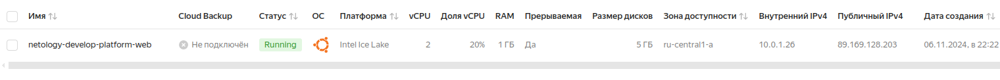
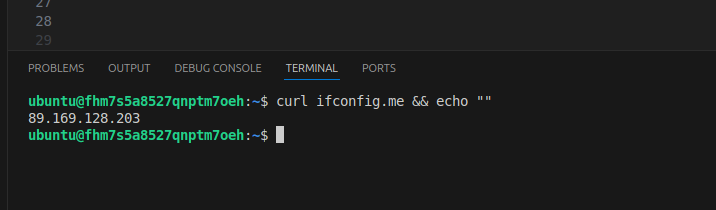
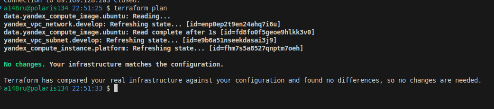
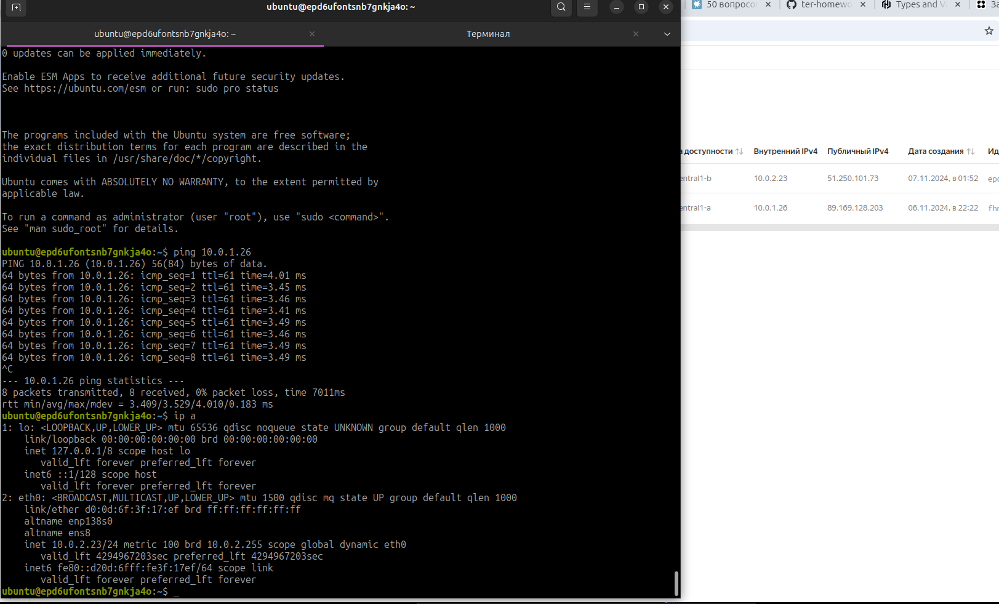
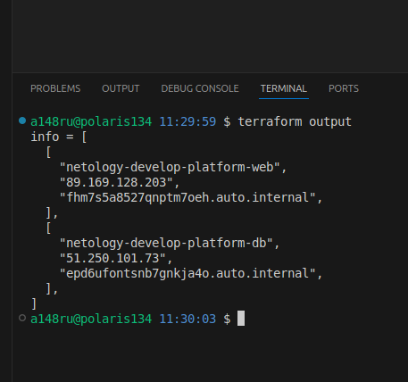
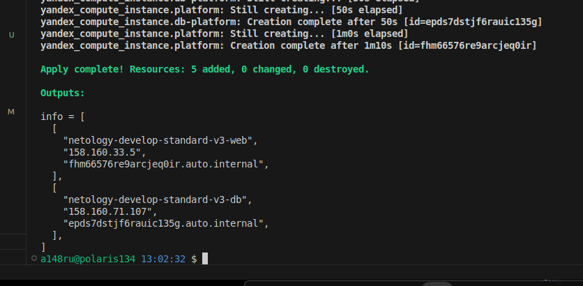
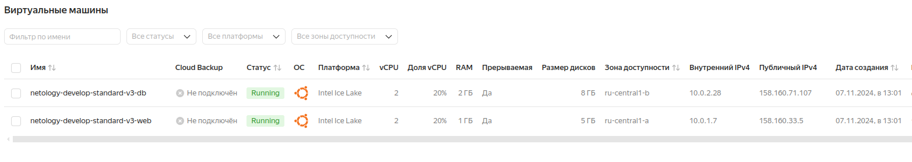
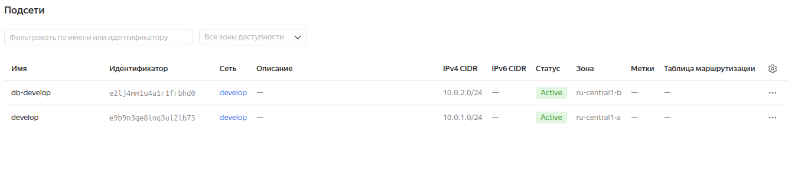
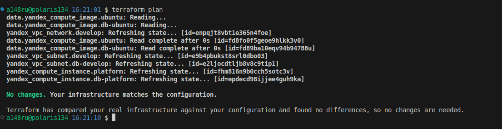

## Задание 1


не совсем понял про синтаксические ошибки, единственное на что ругался - это ```platform_id = "standart-v4"```

исправил на ```platform_id = "standard-v3"``` тут только букву t на d  заменил и версию, т.к. в документации Я.Клауд не нашел описание для v4
как следствие параметры для машины выставил на допустимый минимум для этой платформы.

```rb
resource "yandex_compute_instance" "platform" {
  name        = "netology-develop-platform-web"
  platform_id = "standard-v3"
  resources {
    cores         = 2
    memory        = 1
    core_fraction = 20
  }
  ```






```preemptible = true``` и ```core_fraction=5``` перое параметр прерываемой машины, второй гарантированная доля ЦП - полезно тем что экономит нам деньги, для тестового стенда самое то!


## Задание 2


```rb
variable "vm_web_image" {
  type = string
  default = "ubuntu-2004-lts"
}

variable "vm_web_platform" {
  type = string
  default = "standard-v3"
}
variable "vm_web_cores" {
  type = number
  default = 2
}
variable "vm_web_memory" {
  type = number
  default = 1
}
variable "vm_web_core_fract" {
  type = number
  default = 20
} 
```




## Задание 3



понятно что разные машинки в разных зонах с разным набором параметров, но про сеть не сказано как именно, потому предположил, что должны быть в одной сети и доступны друг другу по внутренним адресам.

## Задание 4



## Задание 5







## Задание 6

```rb
variable vm_param {
  type = map(any)
  default = {
    web = ({
      cores = 2,
      memory = 1,
      core_fract = 20
    }),
    db = ({
      cores = 2,
      memory = 2,
      core_fract = 20
    })
  }
}
###ssh vars

variable "vms_ssh_root_key" {
  type        = string
  # default     = ""
  description = "ssh-keygen -t ed25519"
}

variable "serial_enable" {
  type = number
  default = 1
  description = "Serial port, default = enable (1)"
}

variable "user_name" {
  type = string
  default = "ubuntu"
}
```

```rb
locals {
    web_name = "netology-${var.env}-${var.platform.3}-${var.role[0]}"
    db_name = "netology-${var.env}-${var.platform.3}-${var.role[1]}"
    vms_ssh_root_key = {
        serial_port = ({
            stat = var.serial_enable
        }),
        ssh = ({
            key = "${var.user_name}:${var.vms_ssh_root_key}"
        })
        }
}
```


## Задание 7

7.1
```rb
> local.test_list[1]
"staging"
>  
```
7.2
```rb
> length(local.test_list)
3
>  
```
7.3
```rb
> local.test_map.admin
"John"
>  
```
7.4
```rb
> "${local.test_map.admin} is ${keys(local.test_map)[0]} for ${local.test_list[2]} server based on OS ${local.servers.production.image} with ${local.servers.production.cpu} vcpu, ${local.servers.production.ram} ram and ${length(local.servers.production.disks)} virtual disks"
"John is admin for production server based on OS ubuntu-20-04 with 10 vcpu, 40 ram and 4 virtual disks"
>  
```

## Задание 8

```rb
> type(local.test)
tuple([
    object({
        dev1: tuple([
            string,
            string,
        ]),
    }),
    object({
        dev2: tuple([
            string,
            string,
        ]),
    }),
    object({
        prod1: tuple([
            string,
            string,
        ]),
    }),
])
>  
```

```rb
> local.test[0].dev1[0]
"ssh -o 'StrictHostKeyChecking=no' ubuntu@62.84.124.117"
>  
```
