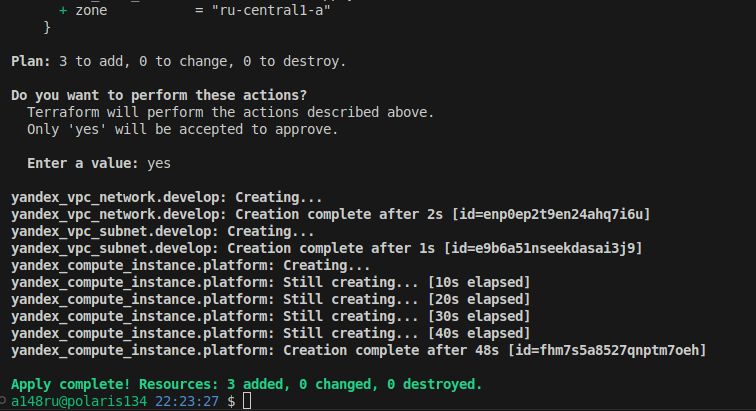

## Задание 1




не совсем понял про синтаксические ошибки, единственное на что ругался - это ```platform_id = "standart-v4"```

исправил на ```platform_id = "standard-v3"``` тут только букву t на d  заменил и версию, т.к. в документации Я.Клауд не нашел описание для v4
как следствие параметры для машины выставил на допустимый минимум для этой платформы.

```rb
resource "yandex_compute_instance" "platform" {
  name        = "netology-develop-platform-web"
  platform_id = "standard-v3"
  resources {
    cores         = 2
    memory        = 1
    core_fraction = 20
  }
  ```


```preemptible = true``` и ```core_fraction=5``` перое параметр прерываемой машины, второй гарантированная доля ЦП - полезно тем что экономит нам деньги, для тестового стенда самое то!


## Задание 2


```rb
variable "vm_web_image" {
  type = string
  default = "ubuntu-2004-lts"
}

variable "vm_web_platform" {
  type = string
  default = "standard-v3"
}
variable "vm_web_cores" {
  type = number
  default = 2
}
variable "vm_web_memory" {
  type = number
  default = 1
}
variable "vm_web_core_fract" {
  type = number
  default = 20
} 
```


## Задание 3
